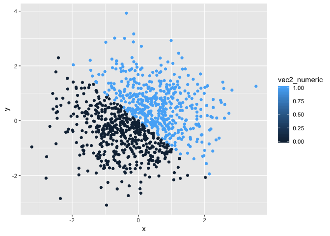

p8105\_hw1\_js5354
================
Jiayi Shen
9/13/2018

Problem 1
---------

``` r
problem1_df = tibble(
  random_sample = sample(0:5, 10, replace=TRUE),
  vec_logical = c(random_sample[1:10]>2),
  vec_char= c("a","b","c","d","e","f","g","h","i","end"),
  vec_factor = factor(c("Y","N", "N", "Y","N", "N", "Y","N", "N", "N"))
)


mean(problem1_df$random_sample)
## [1] 3.3

mean(problem1_df$vec_logical)
## [1] 0.6

mean(problem1_df$vec_char)
## [1] NA

mean(problem1_df$vec_factor)
## [1] NA


class(problem1_df$random_sample)
## [1] "integer"

class(problem1_df$vec_logical)
## [1] "logical"

class(problem1_df$vec_char)
## [1] "character"

class(problem1_df$vec_factor)
## [1] "factor"
```

Mean can be calculate for numeric and logical variables, but not for charactors and factors. Logical vectors are turned to integer vectors when a numerical value is required, with TRUE being mapped to 1 and FALSE to 0. However, charactor vectors and factor vectors cannot be coerced to numeric vectors in the content where a numerical value is required.

``` r
as.numeric(problem1_df$vec_logical)

as.numeric(problem1_df$vec_char)

as.numeric(problem1_df$vec_factor)
```

Factor "Y" and "N" are converted into 1 and 2 respectively. However, characters cannot be converted to numerical values and the result displays "NA".

We are getting this result because the as.numeric function turns factor vectors into underlying numeric representation, though meaningless. However, as.numeric function is not capable of turning letter(s) into numbers so we get "NA" when we apply this function to character vectors.

``` r

as.numeric(as.factor(problem1_df$vec_char))
##  [1]  1  2  3  4  5  7  8  9 10  6

as.numeric(as.character(problem1_df$vec_factor))
## Warning: NAs introduced by coercion
##  [1] NA NA NA NA NA NA NA NA NA NA
```

When character varialbes are first converted to factor and then numeric variables, they are assigned positive intergers starting from 1, in an alphebetic order. On the other hand, when factor varialbes are converted to character and then to numeric, "NA"s were introduced.

Problem 2
---------

``` r
problem2_df = tibble(
  x = rnorm (1000, mean = 0, sd = 1),
  y = rnorm (1000, mean = 0, sd = 1),
  vec2_logical = c( x + y > 0 ), 
  vec2_numeric = as.numeric(vec2_logical),
  vec2_factor = as.factor(vec2_logical)
)

true_proportion = sum(problem2_df$vec2_logical, na.rm=TRUE) / length(problem2_df$vec2_logical)
```

The size of the dataset is 1000, 5 (rows, columns).
The mean of x is 0.0331124 ; the median of x is 0.0210415.
There are 49.8 % of cases for which the logical vector is TRUE.

``` r
ggplot(problem2_df, aes(x = x, y = y, color = vec2_logical)) + geom_point()
```


``` r
ggsave("hw1_first_plot.pdf")
```

    ## Saving 7 x 5 in image

``` r
ggplot(problem2_df, aes(x = x, y = y, color = vec2_numeric)) + geom_point()
```



``` r
ggplot(problem2_df, aes(x = x, y = y, color = vec2_factor)) + geom_point()
```


All three plots produce scatter plots in which two discrete colors are seperated by a straight line y = -x. Coloring by numeric vector generates four discrete color scales evenly spaced between 0 and 1. Because the numeric vector is previously coerced from the logical vector so it only takes values of 0 and 1, the plot that is colored according to numeric vector displays dots of only two colors.
